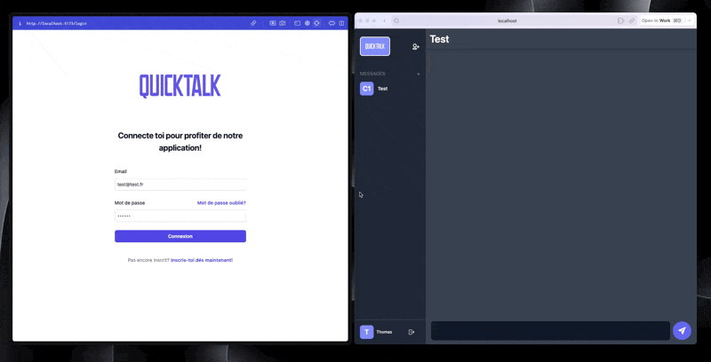

# QuickTalk - Instant Messaging

QuickTalk is a simple and intuitive instant messaging application that allows you to add users and chat with them in real-time. Whether you're coordinating projects, discussing important topics, or simply staying in touch with friends, QuickTalk provides a user-friendly platform for all your conversations.

## Features

### Add Users

- Simple and Fast: Easily add users to your contact list using their identifiers.

### Real-time Conversations

- Instant Messaging: Communicate with your contacts in real-time through a user-friendly interface.

### Contact Management

- Add and Remove Contacts: Customize your contact list by adding new friends or removing those you no longer wish to chat with.

## Contributions

We welcome contributions from the community! If you'd like to enhance QuickTalk or report issues, feel free to open a pull request or an issue.

## License

This project is licensed under the MIT License - see the LICENSE file for more details.
